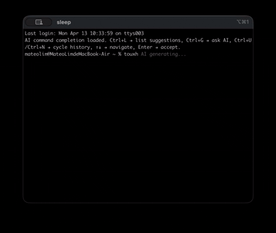

# zsh-supersuggestions

zsh-supersuggestions 是一个轻量的 zsh 插件，提供 AI 命令建议和历史命令增强两大核心能力。

## 快捷键

| 快捷键 | 功能 | 说明 |
|--------|------|------|
| `Ctrl+L` | AI 建议列表 | 调用大模型，返回一组完整的命令建议（l = list） |
| `Ctrl+G` | AI 问答 | 向 AI 提问，返回纯文本回答（g = generate） |
| `Ctrl+U` | 上一个历史命令 | 基于当前输入内容，显示上一条匹配的历史命令（u = up） |
| `Ctrl+N` | 下一个历史命令 | 基于当前输入内容，显示下一条匹配的历史命令（n = next） |

四个快捷键均可通过环境变量自定义。

## 特性

- **智能意图理解**：拼写错误（`toush` → `touch`）、自然语言描述（「adb如何获取设备列表」→ `adb devices`）都能给出正确建议
- AI 建议列表：垂直边框菜单，`↑ / ↓` 切换，`Enter` 接受，`Ctrl+C` 取消
- AI 问答：直接在终端下方显示回答
- 历史多候选：`Ctrl+U / Ctrl+N` 循环切换匹配的历史命令
- 建议结果自动清洗：去重、去编号、去项目符号、去代码块残留
- 仅依赖 `curl`、`jq` 和 `zsh-autosuggestions`

## 示例




## 原理

### AI 建议（Ctrl+L）

1. 你在命令行里输入内容后按 `Ctrl+L`
2. `ai-complete.zsh` 读取当前输入，并在后台调用 `ai-command-request.sh`
3. `ai-command-request.sh` 让大模型返回"每行一条"的完整命令建议
4. 返回结果会在共享请求层本地再次清洗，过滤掉空行、编号、项目符号、代码块残留和重复项
5. 清洗后的结果交给 zsh 插件渲染成可选择的建议列表
6. 你可以用 `↑ / ↓` 切换，用 `Enter` 把选中的命令填回当前输入框

### AI 问答（Ctrl+G）

1. 输入问题后按 `Ctrl+G`
2. 后台调用 `ai-command-request.sh`，获取纯文本回答
3. 回答直接显示在终端下方

### 历史命令增强（Ctrl+U / Ctrl+N）

基于官方 `zsh-users/zsh-autosuggestions` 扩展：从命令历史中匹配当前输入前缀，以灰色 inline suggestion 显示，`Ctrl+U / Ctrl+N` 循环切换。无匹配时回退到原生行为（`kill-line` / `down-line-or-history`）。

## 文件说明

- `ai-complete.zsh`：zsh 插件总入口，负责 setup、autosuggestions 加载、配置校验、快捷键注册、widget 调度
- `ai-suggest.zsh`：`Ctrl+L` 核心模块，AI 菜单状态管理、边框渲染、导航、accept/cancel
- `ai-generate.zsh`：`Ctrl+G` 核心模块，AI 问答、回答显示
- `zsh-autosuggestions-enhance.sh`：基于官方 `zsh-users/zsh-autosuggestions` 的历史多候选 inline cycling 增强层
- `ai-command-request.sh`：共享请求层，负责配置校验、提示词加载、API 请求与结果清洗

## 安装

1. 克隆仓库：

```bash
git clone https://github.com/scsfwgy/zsh-supersuggestions
cd zsh-supersuggestions
```

2. 在 `~/.zshrc` 中加入配置：

```bash
# 必填
export AI_COMPLETE_API_KEY="sk-..."
export AI_COMPLETE_MODEL="gpt-4o-mini"
export AI_COMPLETE_API_URL="https://api.openai.com/v1/chat/completions"

# 可选
export AI_COMPLETE_API_TYPE="openai"      # openai（默认）或 claude
export AI_COMPLETE_MAX_ITEMS=5            # 建议条数，默认 5
export AI_COMPLETE_TRIGGER_BINDKEY='^L'   # 可自定义四个快捷键
export AI_COMPLETE_ASK_BINDKEY='^G'
export AI_COMPLETE_HISTORY_PREV_BINDKEY='^U'
export AI_COMPLETE_HISTORY_NEXT_BINDKEY='^N'

source /path/to/zsh-supersuggestions/ai-complete.zsh
```

快捷键值必须使用 zsh `bindkey` 原生语法（如 `'^T'`、`'^Y'`）。非法值会导致插件报错并停止加载。

3. 重新加载 shell：

```bash
source ~/.zshrc
```

### API 配置示例

```bash
# DeepSeek
export AI_COMPLETE_API_KEY="sk-ebfbeed****854700044d"
export AI_COMPLETE_API_URL="https://api.deepseek.com/v1/chat/completions"
export AI_COMPLETE_MODEL="deepseek-chat"
source ~/zsh-supersuggestions/ai-complete.zsh
```

```bash
# Claude
export AI_COMPLETE_API_TYPE="claude"
export AI_COMPLETE_API_KEY="sk-ant-..."
export AI_COMPLETE_API_URL="https://api.anthropic.com/v1/messages"
export AI_COMPLETE_MODEL="claude-sonnet-4-20250514"
source ~/zsh-supersuggestions/ai-complete.zsh
```

### 依赖

需要 `jq` 和 `curl`：

```bash
brew install jq curl
```

同时依赖 `zsh-autosuggestions`，首次加载时会自动提示下载到 `vendor/zsh-autosuggestions`。也可手动安装：

```bash
brew install zsh-autosuggestions
```

## 相关项目

| 项目 | 触发时机 | 知识来源 | 多候选 | 网络依赖 |
|------|----------|----------|--------|----------|
| [thefuck](https://github.com/nvbn/thefuck) | 命令失败后（事后） | 100+ 条内置规则 | 单条修正 | 无 |
| [zsh-autosuggestions](https://github.com/zsh-users/zsh-autosuggestions) | 输入时实时（事中） | 命令历史 + 补全引擎 | 单条 inline | 无 |
| **zsh-supersuggestions** | 按快捷键主动触发 | LLM + 命令历史 | 多候选菜单 / cycling | 需要 |

## 注意事项

- 本插件依赖 zsh 的 ZLE 机制，不适用于 bash
- `Tab` 和 `Shift+Tab` 均未被占用，仍可保留给原生补全或其它插件
